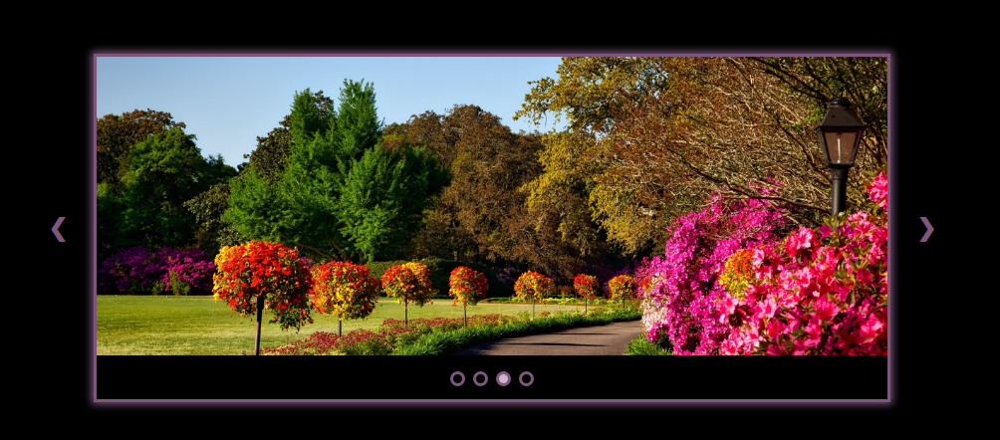

# Photo Slider

I built a photo slider using JavaScript, CSS, and HTML. 

***Slider Features***

1. The side control arrows to move the slider quicker. Each button will move the images in the direction the arrow is pointing.

2. The dot indicators under the photos show which photo is being viewed. The user can also click the dot indicator of a specific photo to jump to that photo.

3. If the user hovers over a photo it will freeze on the image unter the user removes their mouse from the photo. When the mouse is removed the photo slider will resume auto sliding the images.

***Credits***

All photos were found on pexels.com.

  Author Credits:
  
  a. Photos one and three: Pixabay

  b. Photo two: Ian Turnell

  c. Photo four: Lalesh Aldarwish

